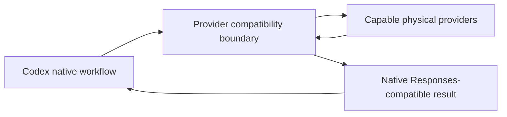

# Codex DeepSeek Shim

Codex DeepSeek Shim explored a provider-compatibility and routing layer for Codex workflows while preserving Codex-visible OpenAI Responses semantics and adapting physical providers behind that boundary.

## Why it matters

- Expands provider choice inside Codex workflows.
- Enables cost/performance matching across capable models.
- Aims to preserve one consistent Codex-facing experience while providers vary behind it.
- Keeps provider adaptation separate from project orchestration.
- Supports experimentation without making provider mechanics the user workflow.

## Conceptual architecture

## Benchmark methodology

Benchmarking freezes task packets and repository state, uses identical tools, permissions, and acceptance gates across routes, and records functional acceptance, defects, retries, human intervention, latency, tokens/cost, cache behavior, and failures. Runs are repeated, results are labeled Observed/Derived/Proposed/Unknown, and results are published only when reproducible.

## Research and demos

Public notes and demos will focus on provider compatibility, native-workflow preservation, provider/task fit, cost/performance evidence, and failure recovery. Actual measured results are pending validated evidence and must not be invented.

These experimental integrations modified Codex workflow behavior. In practice, defects in Agent System and Shim introduced unacceptable instability. The current Codex app integration surface also limited the stability guarantees the implementation needed to provide.

**The implementation is no longer publicly available due to stability issues.**

A new public version will be added when the required stability has been achieved.

## Future public release

A future stable public version may include architecture diagrams at an appropriate abstraction level, measured outcomes, research notes, demos, benchmark methodology and results, and selected interfaces/contracts. Implementation internals and private operating material remain private.

The implementation is unsupported. Users should discontinue use and remove deployed copies.

[OpenCodex](https://github.com/lidge-jun/opencodex) is a related public alternative for provider-flexible Codex workflows. It is a separate project—not the same implementation, an official successor, partner, dependency, or drop-in replacement.
